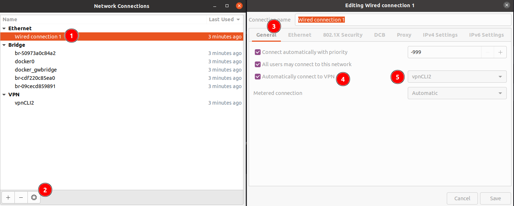
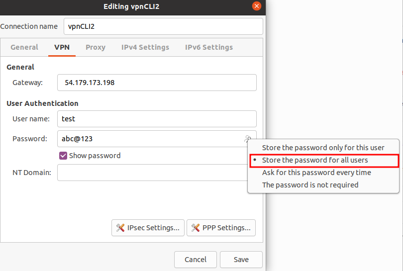

# I. Common

### Collect the vpn information before setting the VPN connection
Install required service (run on Client)
``` 
sudo apt-get install libreswan network-manager-l2tp  network-manager-l2tp-gnome -y
```

Run this command to collect vpn connect information (run on Server)
```
docker logs ipsec-vpn-server
```

The information will like this:
```
Trying to auto discover IPs of this server...


================================================

IPsec VPN server is now ready for use!

Connect to your new VPN with these details:

DNS: 8.8.8.8
Server IP: 54.179.173.198
IPsec PSK: test_shared_secret_key
Users credentials :
Login : userTest1 Password : test1
Login : userTest2 Password : test2

Write these down. You'll need them to connect!

Setup VPN Clients: https://git.io/vpnclients

================================================

Redirecting to: /etc/init.d/ipsec start
Starting pluto IKE daemon for IPsec: Initializing NSS database

.
xl2tpd[1]: setsockopt recvref[30]: Protocol not available
xl2tpd[1]: This binary does not support kernel L2TP.
xl2tpd[1]: xl2tpd version xl2tpd-1.3.6 started on c2cb5bafd1c8 PID:1
xl2tpd[1]: Written by Mark Spencer, Copyright (C) 1998, Adtran, Inc.
xl2tpd[1]: Forked by Scott Balmos and David Stipp, (C) 2001
xl2tpd[1]: Inherited by Jeff McAdams, (C) 2002
xl2tpd[1]: Forked again by Xelerance (www.xelerance.com) (C) 2006
xl2tpd[1]: Listening on IP address 0.0.0.0, port 1701
```
# II. Setting via GUI

### 1. Setting Client

```
1. Go to Settings -> Network -> VPN. Click the + button.
2. Select Layer 2 Tunneling Protocol (L2TP).
- Enter anything you like in the Name field.
- Enter Your VPN Server IP for the Gateway.
- Enter Your VPN Username for the User name.
- Right-click the ? in the Password field, select Store the password only for this user.
- Enter Your VPN Password for the Password.
- Leave the NT Domain field blank.
3. Click the IPsec Settings... button.
- Check the Enable IPsec tunnel to L2TP host checkbox.
- Leave the Gateway ID field blank.
- Enter Your VPN IPsec PSK for the Pre-shared key.
- Expand the Advanced section.
- Enter aes128-sha1-modp2048 for the Phase1 Algorithms.
- Enter aes128-sha1 for the Phase2 Algorithms.
- Click OK, then click Add to save the VPN connection information.
4. Turn the VPN switch ON.
```

# III. Setting via CLI

### 0. Prepare (Skip this step if your system already have nmcli)
This setting guide that use the Network-manager CLI (nmcli) to config. If your system don't have nmcli, you should download.
```
APT

sudo apt-get install network-manager -y
sudo systemctl start NetworkManager.service 
sudo systemctl enable NetworkManager.service
```
```
SNAP

sudo apt install snapd
sudo systemctl enable --now snapd.socket
sudo ln -s /var/lib/snapd/snap /snap
snap install network-manager
snap connections network-manager
```

### 1. Create VPN connection
```
sudo nmcli connection add connection.id [vpnName] con-name [vpnName] type VPN vpn-type l2tp ifname -- connection.autoconnect no ipv4.method auto vpn.data "gateway = [vpnServerIP], ipsec-enabled = yes, ipsec-psk = [vpnPSK], mru = 1400, mtu = 1400, password-flags = 0, refuse-chap = no, refuse-mschap = no, refuse-pap = no, require-mppe = no, user = [vpnUser]" vpn.secrets "password=[vpnPassword]"
```
- [vpnName]: The name of VPN Connection
- [vpnServerIp]: The Public IP address of VPN Server
- [vpnPSK]: The Pre-Share Key 
- [vpnUser]: User VPN
- [vpnPassword]: Password of User VPN

Eg:
```
sudo nmcli connection add connection.id vpnCLI2 con-name vpnCLI2 type VPN vpn-type l2tp ifname -- connection.autoconnect no ipv4.method auto vpn.data "gateway = 54.179.173.198, ipsec-enabled = yes, ipsec-psk = test_psk, mru = 1400, mtu = 1400, password-flags = 0, refuse-chap = no, refuse-mschap = no, refuse-pap = no, require-mppe = no, user = test" vpn.secrets "password=abc@123"
```

### 2. Enable VPN
Command
```
nmcli c up [vpnName]
```
Eg:
```
nmcli c up vpnCLI2
```

# IV. Checking
Once connected, you can verify that your traffic is being routed properly by looking up your IP address on Google. It should say "Your public IP address is Your VPN Server IP".

- Browser: 
https://whatismyipaddress.com/

- CLI ```curl ifconfig.me.```

# V. Setting auto connect VPN 

### 1. Auto connect on boot
Use this command to open Network Connections setting
```
nm-connection-editor
```

####Choose the Ethernet -> General -> Check the "Automatically connect to VPN" -> Choose the VPN connection -> Save



#### *Note*: The password of VPN user must be available for all user.



### 2. Auto retry connect when fail

Use the script "auto_retry.sh" as a service

```
sudo nano /lib/systemd/system/auto_retry_vpn.service
```

Paste this 
```
[Unit]
Description=My Shell Script

[Service]
ExecStart=/$your_path/auto_retry_vpn.sh

[Install]
WantedBy=multi-user.target
```

Reload Systemd

```
sudo systemctl daemon-reload 
```

Start service
```
sudo systemctl start auto_retry_vpn.service
```

Enable service to auto run on boot

```
sudo systemctl enable auto_retry_vpn.service
```

Check service

```
sudo systemctl status auto_retry_vpn.service
```
